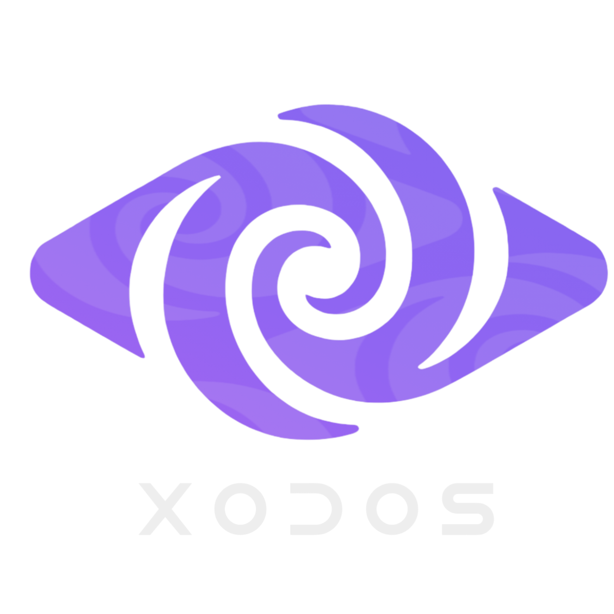

# XoDos Rebirth 
<p align="center">
  
</p>
<div align="center">
  
[](https://github.com/xodiosx/XoDos2/releases)
[](https://t.me/xodemulatorr)
[](https://discord.gg/d2ChVhPfnF)

> **"The only thing worse than being blind is having sight but no vision."** - Helen Keller
>
> **"The real voyage of discovery consists not in seeking new landscapes, but in having new eyes."** - Marcel Proust
>
> **"Awakening is not changing who you are, but discarding who you are not."** - Deepak Chopra


## ✨ What is XoDos?
**XoDos** is a revolutionary Linux desktop environment that runs seamlessly on Android devices, bringing the full power of Linux to your mobile device without conflicts with other applications.

XoDos Rebirth is the next evolution of the original [XoDos](https://github.com/xodiosx/XoDos) project, now reimagined and rebuilt from the ground up. Inspired by the [tiny computer project](https://github.com/Cateners/tiny_computer), XoDos offers:
<!-- Your entire README content here -->

- 🔄 **Conflict-Free**: Designed not to interfere with Termux, Termux X11, or other Android applications
- 🚀 **Standalone Experience**: A complete Linux desktop environment running natively on Android
- 📱 **Mobile-Optimized**: Tailored specifically for Android devices and touch interfaces
- 🔧 **Developer Friendly**: Perfect for coding, testing, and development on the go
- 📚 **Students Friendly**: Perfect for students and office trainings, using wide range of office Apps, and writing / learning on the go

## 🎯 Key Features

- **Complete Linux Desktop** - Full desktop environment with window management
- **Windows Compatibility** - Wine with Box64 to run Windows x86-64 games/apps 
- **Android Integration** - Seamlessly works alongside your Android apps
- **No Root Required** - Runs without needing root access
- **Lightweight** - Optimized for mobile devices and resource efficiency
- **Open Source** - Community-driven development and transparency

## 📥 Installation

XoDos APKs are available in the [GitHub Releases](https://github.com/xodiosx/XoDos2/releases) section, install and wait until the desktop environment is fully loaded.

## 📚 Fix phantom process termination or killing

In Android versions higher than 11 the app suddenly stops to work because Android think that the process is phantom and kill it, a exception need to be added for this app to avoid this. You can learn how to this below:

- https://github.com/xodiosx/XoDos2/blob/main/phantom.md
- https://github.com/xodiosx/XoDos2/blob/main/signal9fix.md

--------------------------------------------------------------------------------------------

## 🛠️ Development Status

XoDos is currently in active development. We're working hard to deliver a stable and feature-rich experience. Here's what to expect:

- [x] Core Linux environment integration
- [x] Windows environment integration (wine / box64)
- [x] Desktop environment setup
- [x] Android compatibility layer
- [x] User interface optimization
- [x] Performance tuning
- [x] touch gamepad controls
- [x] easy wine settings
- [x] gamepad support
- [x] More GPU drivers for Android devices
- [x] native android bionic terminal shell support

## Building rootfs using Termux or other Linux terminal emulator

[XoDos Proot(rootfs)](https://github.com/xodiosx/XoDos2/tree/main/extra/rootfs)

for flutter just clone this repo and build using flutter SDK and android SDK make sure
the building environment is ready with Android sdk and Java jdk and ndk and using this command

```
git clone https://github.com/xodiosx/XoDos2.git && cd XoDos2 && flutter build apk --target-platform android-arm64 --split-per-abi
```

## 🤝 Contributing

We welcome and encourage contributions from developers of all skill levels! Whether you're interested in:

- **Code Development** - Help build core features
- **Testing** - Provide feedback and bug reports
- **Documentation** - Improve guides and documentation
- **UI/UX Design** - Enhance the user experience
- **Community Support** - Help other users

### Get Involved

Join our communities to connect with the development team and other contributors:

- [Telegram](https://t.me/xodemulatorr)
- [Discord](https://discord.gg/d2ChVhPfnF)

## 📱 Legacy Version

Looking for the original XoDos? Check out the first version [here](https://github.com/xodiosx/XoDos).

## 📄 License

This project is open source. Specific license details will be provided with the first release.

## 💝 Made with Love

XoDos is being developed with passion and dedication by the XoDos developer team, committed to bringing Linux to Android in the most accessible way possible.

---

**Support ❤️ and buy me a ☕**
https://buymeacoffee.com/karysdev?new=1

For crypto currency donations we accept USDT in the following wallet address:

```
0x96e8c405d10da473f5afbe02b514d405131a3804
```

---
*XoDos - Bringing Linux to Your Android Device*
